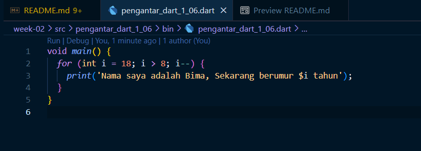

# Name: Bima Bayu Saputra
# NIM: 2141720019
# Project: Looping Fulan Umur

## Task 1

## Task 2
Mengapa sangat penting untuk memahami bahasa pemrograman Dart sebelum kita menggunakan framework Flutter ? Jelaskan!

Sebelum menggunakan framework Flutter, pemahaman yang kuat terhadap bahasa pemrograman Dart sangatlah penting. Ini karena Dart adalah bahasa resmi yang digunakan dalam Flutter, memberikan kontrol yang lebih besar dalam pengembangan, membantu dalam mengoptimalkan kinerja, menyederhanakan proses debugging, memperkuat pemahaman tentang konsep berorientasi objek (OOP), dan meningkatkan produktivitas dalam pengembangan aplikasi Flutter. Dengan demikian, memahami Dart merupakan fondasi yang utama untuk kesuksesan sebagai pengguna framework Flutter.

## Task 3
Rangkuman Video Minggu 2

Fitur-fitur bahasa Dart:

- **Productive Tooling**: Alat-alat untuk menganalisis kode dengan efisien.
- **Garbage Collection**: Mengelola memori untuk efisiensi penggunaan.
- **Type Annotations (Opsional)**: Menjaga konsistensi data dalam aplikasi (opsional).
- **Statically Typed**: Dart menggunakan type-safe dan type inference untuk analisis tipe pada runtime.
- **Portability**: Bisa digunakan untuk pengembangan di web, desktop, dan mobile.

Operator Aritmatika:
- `+` penjumlahan
- `-` pengurangan
- `*` perkalian
- `/` pembagian
- `~/` pembagian bulat
- `%` operasi modulus
- `-expression` negasi

Operator Increment/Decrement:
- `++var` (pra-penambahan)
- `var++` (pasca-penambahan)
- `--var` (pra-pengurangan)
- `var--` (pasca-pengurangan)

Operator Kesetaraan dan Relasional:
- `==` sama
- `!=` tidak sama
- `>` lebih besar
- `<` lebih kecil
- `>=` lebih besar atau sama dengan
- `<=` lebih kecil atau sama dengan

Operator Logika:
- `!expression` (negasi)
- `||` logika OR
- `&&` logika AND

Dart menggunakan function dan method untuk memisahkan dan mengorganisir kode, di mana keduanya menerima data, menjalankan kode, dan mengembalikan hasil.

## Task 4
Perbedaan Null Safety dan Late Variable

https://docs.google.com/presentation/d/1fOScZUcjusW28d3SrlHAaYYRzOrBDmd6D7vccGQxYZ0/edit#slide=id.g2421ea5275c_0_52