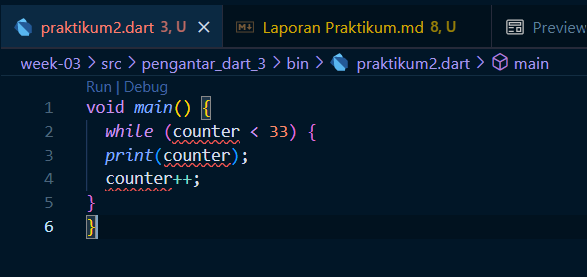

# Dart_3

## **Praktikum 1: Menerapkan Control Flows ("if/else")**

### *Langkah 1*

>

### *Langkah 2*

>
>> Program menjalankan perintah `if` dan `else` untuk menentukan 'Test' mana yang harus dicetak sesuai dengan nilai yang diinputkan.
### *Langkah 3*

>
>> Program error karena terjadi deklarasi variabel yang sama pada baris 2 dan 12. Lalu value variabel `test` tidak disi dengan nilai apapun untuk menjadi bolean.

### *Langkah Perbaikan*

>

## **Praktikum 2: Menerapkan Perulangan "while" dan "do-while"**

### *Langkah 1*

>

### *Langkah 2*

>
>> error terjadi karena variable 'counter' berlum dideklarasikan dan inisialisasi sebelumnya.

### *Langkah 2_Perbaikan*

> Perbaikan seperti gambar dibawah ini.
>>

### *Langkah 3*

>
>> Program tidak error karena variable 'counter' sudah dideklarasikan dan diinisialisasi sebelumnya. Dan hasil program langsung menyambung dengan program sebelumnya.

## **Praktikum 3: Menerapkan Perulangan "for" dan "break-continue"**

### *Langkah 1*

>

### *Langkah 2*

> error terjadi karena variable 'index' berlum dideklarasikan sebelumnya. Perbaiknya seperti gambar dibawah ini.
>>

### *Langkah 3*

>
>> Program error karena  steatment operasi yang digunakan adalah `or` harusnya `and`. Perbaikanya dibawah ini.
>