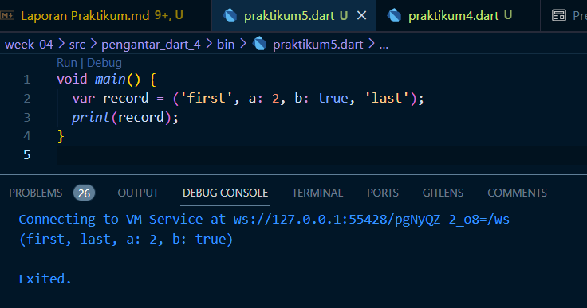

# Dart_4

## Bima Bayu Saputra || 2141720019 || 08/TI-3H

## Praktikum_1

### Langkah 1

### Langkah 2

Kode ini menghasilkan output pertama adalah panjang list, kemudian nilai indeks 1, dan kemudian mencetak nilai indeks 1 setelah diubah.

### Langkah 3

### Langkah 4

## Praktikum_2

### Langkah 1

### Langkah 2

Kode ini menghasilkan output print nilai dari `var halogens`.

### Langkah 3

Bisa berjalan tanpa erorr.

### Langkah 4

## Praktikum_3

### Langkah 1

### Langkah 2

Kode ini menghasilkan output print nilai dari `var gifts` dan `var nobleGases`.

### Langkah 3

Tidak erorr namun `mhs1` dan `mhs2` tidak memiliki nilai, karena masih digunakan variable `gifts` dan `nobleGases` dalam assignmentnya.

### Langkah 4

### Langkah 5

## Praktikum_4

### Langkah 1

### Langkah 2

list1 tidak terdefinisi.

### Langkah 3

Warning karena adanya operan null.

### Langkah 4

True

False

### Langkah 5

Manager

Employee

### Langkah 6

Manfaat dari collection for adalah memungkinkan membuat koleksi baru dengan cara yang efisien berdasarkan elemen-elemen dari koleksi yang ada, tanpa membuat loop manual. Membuat kode menjadi lebih ringkas dan mudah dibaca.

## Praktikum_5

### Langkah 1

### Langkah 2

Tidak terjadi error, hanya ada kurang tanda `;` pada akhir code print.

### Langkah 3

### Langkah 4

### Langkah 5

