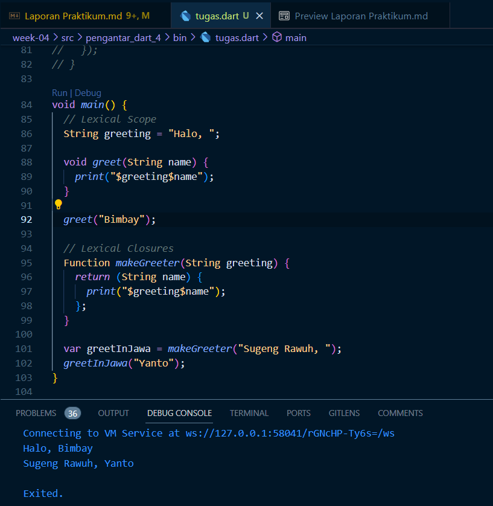

# Dart_4

## Bima Bayu Saputra || 2141720019 || 08/TI-3H

## Praktikum_1

### Langkah 1

### Langkah 2

Kode ini menghasilkan output pertama adalah panjang list, kemudian nilai indeks 1, dan kemudian mencetak nilai indeks 1 setelah diubah.

### Langkah 3

### Langkah 4

## Praktikum_2

### Langkah 1

### Langkah 2

Kode ini menghasilkan output print nilai dari `var halogens`.

### Langkah 3

Bisa berjalan tanpa erorr.

### Langkah 4

## Praktikum_3

### Langkah 1

### Langkah 2

Kode ini menghasilkan output print nilai dari `var gifts` dan `var nobleGases`.

### Langkah 3

Tidak erorr namun `mhs1` dan `mhs2` tidak memiliki nilai, karena masih digunakan variable `gifts` dan `nobleGases` dalam assignmentnya.

### Langkah 4

### Langkah 5

## Praktikum_4

### Langkah 1

### Langkah 2

list1 tidak terdefinisi.

### Langkah 3

Warning karena adanya operan null.

### Langkah 4

True

False

### Langkah 5

Manager

Employee

### Langkah 6

Manfaat dari collection for adalah memungkinkan membuat koleksi baru dengan cara yang efisien berdasarkan elemen-elemen dari koleksi yang ada, tanpa membuat loop manual. Membuat kode menjadi lebih ringkas dan mudah dibaca.

## Praktikum_5

### Langkah 1

### Langkah 2

Tidak terjadi error, hanya ada kurang tanda `;` pada akhir code print.

### Langkah 3

### Langkah 4

### Langkah 5

## Tugas

### Silakan selesaikan Praktikum 1 sampai 5, lalu dokumentasikan berupa screenshot hasil pekerjaan Anda beserta penjelasannya!

### Jelaskan yang dimaksud Functions dalam bahasa Dart!

Functions dalam bahasa Dart adalah blok kode yang digunakan untuk melakukan tugas-tugas tertentu dalam program. Functionereka membantu dalam mengorganisir dan merapikan kode serta bisa mengembalikan nilai atau tidak, tergantung pada kebutuhan program.

### Jelaskan jenis-jenis parameter di Functions beserta contoh sintaksnya!

* Positional Parameters (Parameter Berdasarkan Posisi):

Jenis parameter ini ditentukan berdasarkan urutan posisi saat memanggil fungsi. Jumlah dan tipe parameter harus sesuai dengan yang dideklarasikan dalam fungsi.

* Named Parameters (Parameter Bernama):

Jenis parameter ini diberi nama saat deklarasi, dan pengguna harus menyebutkan nama parameter saat memanggil fungsi. Ini memungkinkan Anda untuk mengabaikan urutan posisi.

* Default Parameters (Parameter Default):

Anda dapat memberikan nilai default kepada parameter, yang akan digunakan jika pengguna tidak memberikan nilai saat memanggil fungsi.

* Required Parameters (Parameter Wajib):

Mulai dari Dart 2.12, Anda dapat menandai parameter sebagai wajib dengan menggunakan kata kunci required. Pengguna harus memberikan nilai untuk parameter tersebut saat memanggil fungsi.

* Rest Parameters (Parameter Sisa):

Jika Anda tidak tahu berapa banyak parameter yang akan digunakan, Anda dapat menggunakan parameter sisa (rest parameter) dengan tanda ... untuk mengumpulkan semua argumen yang tidak digunakan oleh parameter lainnya.

Contoh:

### Jelaskan maksud Functions sebagai first-class objects beserta contoh sintaknya!

Dalam Dart, fungsi dianggap sebagai first-class objects, jika dapat:

* Menyimpan fungsi dalam variabel.
* Mengirim fungsi sebagai argumen ke fungsi lain.
* Mengembalikan fungsi sebagai nilai dari fungsi lain.

Contoh:

### Apa itu Anonymous Functions? Jelaskan dan berikan contohnya!

Dalam bahasa Dart, anonymous functions dikenal sebagai "anonymous function" atau "lambda function.". Digunakan untuk membuat fungsi sederhana tanpa memberikan nama. Anonymous functions sering digunakan dalam pemrograman Dart untuk berbagai tugas, seperti pemrosesan daftar (list) atau sebagai argumen dalam fungsi lain.

Contoh:

### Jelaskan perbedaan Lexical scope dan Lexical closures! Berikan contohnya!

Lexical Scope adalah aturan tentang bagaimana variabel diakses berdasarkan struktur kode, sedangkan Lexical Closures adalah kemampuan fungsi untuk mengingat lingkup lexicalnya dan mengakses variabel-variabelnya bahkan setelah fungsi tersebut selesai dieksekusi.

Contoh:

### Jelaskan dengan contoh cara membuat return multiple value di Functions!

Mengembalikan multiple values dari sebuah fungsi dengan menggabungkannya dalam sebuah objek atau struktur data

Contoh:

`getPersonInfo()` mengembalikan `Map` yang berisi nama, usia, dan lokasi, dan kita mengakses nilai-nilai tersebut dengan kunci (keys) yang sesuai.