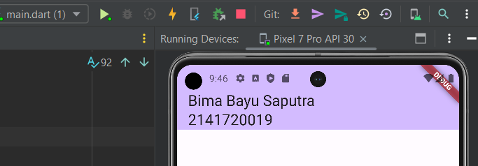
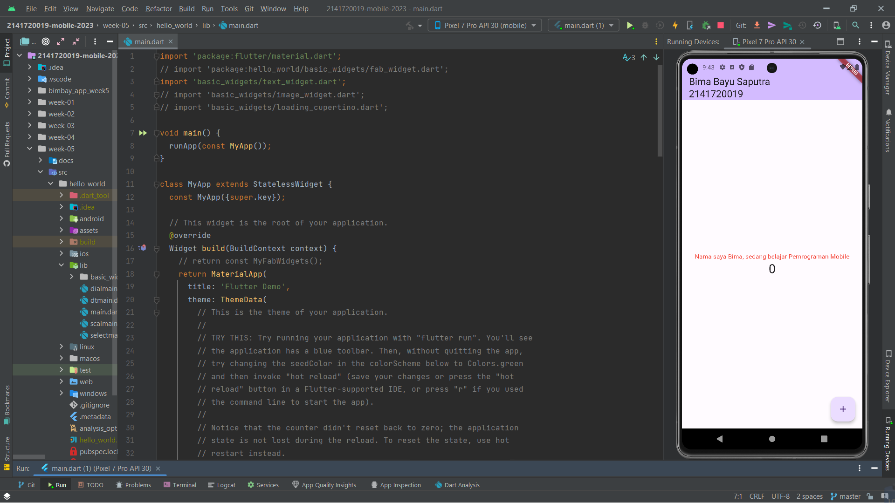
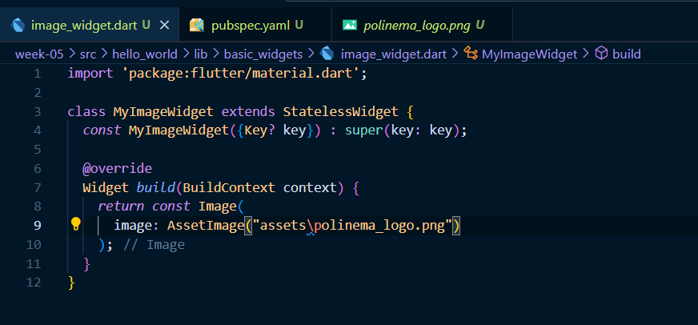
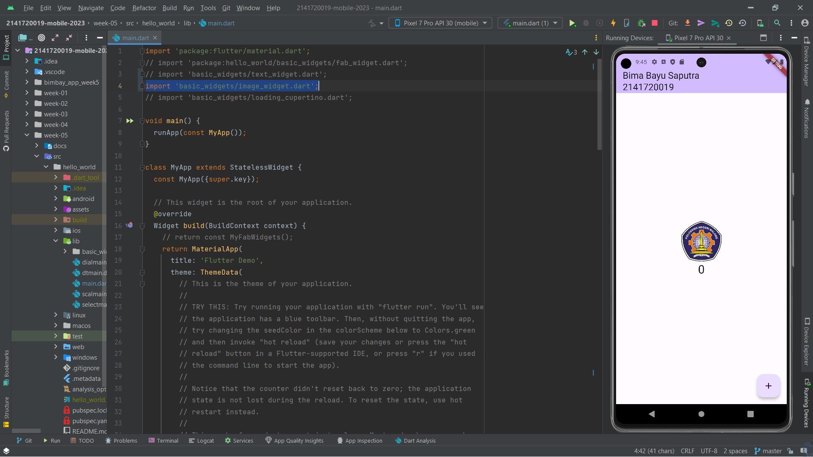
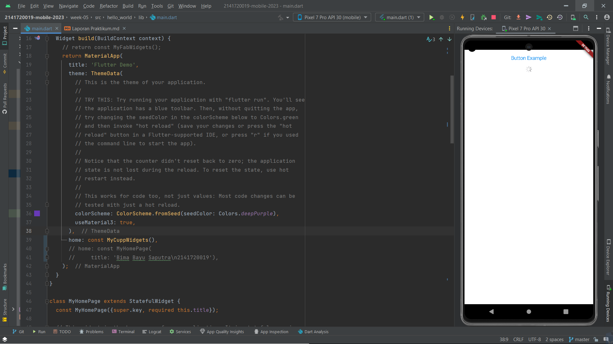
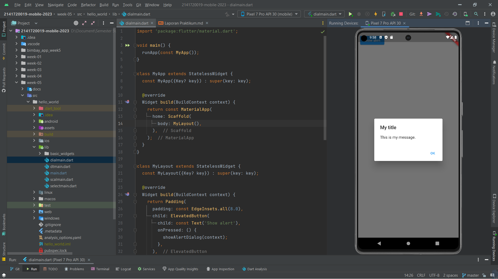

# Tugas Praktikum

1. Selesaikan Praktikum 1 sampai 4, lalu dokumentasikan dan push ke repository Anda berupa screenshot setiap hasil pekerjaan beserta penjelasannya di file README.md!
2. Pada praktikum 4 mulai dari Langkah 3 sampai 6, buatlah file widget tersendiri di folder basic_widgets, kemudian pada file main.dart cukup melakukan import widget sesuai masing-masing langkah tersebut!
3. Selesaikan Codelabs: Your first Flutter app, lalu buatlah laporan praktikumnya dan push ke repository GitHub Anda!
4. README.md berisi: capture hasil akhir tiap praktikum (side-by-side, bisa juga berupa file GIF agar terlihat proses perubahan ketika ada aksi dari pengguna) di browser dan perangkat fisik (device) dengan menampilkan NIM dan Nama Anda sebagai ciri pekerjaan Anda. Jika mode developer di perangkat HP Anda belum aktif, silakan cari di internet cara mengaktifkannya!
5. Kumpulkan berupa link repository/commit GitHub Anda ke tautan spreadsheet yang telah disepakati oleh dosen!

## Tugas 1

### Praktikum 1

- Menjalankan command untuk scaffolding project flutter
  
  ***
  
  ***
  

- Project flutter telah berhasil dibuat
  

### Praktikum 2

- Menyiapkan repository github
- Mengubah title aplikasi menjadi nama dan nim

### Praktikum 3

- **Text Widget**
  - Membuat stateless text_widget 
  - Menambahkan widget text_widget pada main 
- **Image Widget**
  - Membuat stateless image_widget 
  - Menambahkan widget image_widget pada main 

### Praktikum 4

- **Cupertino Button dan Loading Bar**

- **Floating Action Button (FAB)**

- **Scaffold Widget**

- **Dialog Widget**

- **Input dan Selection Widget**

- **Date and Time Pickers**

## Tugas 3

- **Tampilan Awal**
  
- **Like**
  
- **Next**
  
- **Show Like**
  
Hasil praktikum : [First Flutter app](https://github.com/BimaBayuUWUUU/2141720019-mobile-2023/tree/master/bimbay_app_week5/my_awesome_namer)
