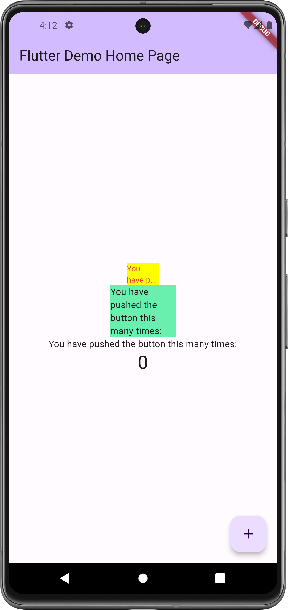

# Parktikum 1
## Plugin

# Tugas Praktikum 1
## Soal
1. Selesaikan Praktikum tersebut, lalu dokumentasikan dan push ke repository Anda berupa screenshot hasil pekerjaan beserta penjelasannya di file README.md!
2. Jelaskan maksud dari langkah 2 pada praktikum tersebut!
3. Jelaskan maksud dari langkah 5 pada praktikum tersebut!
4. Pada langkah 6 terdapat dua widget yang ditambahkan, jelaskan fungsi dan perbedaannya!
5. Jelaskan maksud dari tiap parameter yang ada di dalam plugin auto_size_text berdasarkan tautan pada dokumentasi ini !
6. Kumpulkan laporan praktikum Anda berupa link repository GitHub ke spreadsheet yang telah disediakan!

## Jawaban
* Langkah 2: Pemasangan Plugin

Langkah ini melibatkan penambahan plugin `auto_size_text` ke dalam proyek Flutter menggunakan perintah `flutter pub add`. Tujuannya adalah memasukkan referensi plugin ke dalam file `pubspec.yaml` sebagai bagian dari dependencies proyek. Tindakan ini memungkinkan proyek untuk memanfaatkan dan menggunakan plugin `auto_size_text` dengan cara mengimpor dan menerapkannya dalam kode proyek.

* Langkah 5: Pendefinisian Variabel `text` dan Parameter dalam Konstruktor

Pada tahap ini, sebuah variabel `text` dimasukkan ke dalam kelas `RedTextWidget` sekaligus ditambahkan sebagai parameter dalam konstruktor kelas tersebut. Langkah ini memungkinkan pengguna untuk menentukan teks yang akan ditampilkan dalam `RedTextWidget` ketika menciptakan instance dari widget tersebut.

* Langkah 6: Penambahan Widget dalam `main.dart`

Tahap ini melibatkan penambahan dua widget di dalam class `_MyHomePageState` di file `main.dart`.
1. `RedTextWidget`: Widget kustom ini menggunakan fungsi `AutoSizeText` dari plugin `auto_size_text` untuk menampilkan teks dengan gaya yang telah ditentukan dalam `RedTextWidget`.
2. `Text`: Merupakan widget bawaan dari Flutter yang digunakan untuk menampilkan teks dengan gaya yang telah ditentukan sebelumnya.

Perbedaan utama terletak pada penggunaan widget kustom (`RedTextWidget`) yang menggunakan fungsi `AutoSizeText` dari plugin `auto_size_text` untuk menampilkan teks, sedangkan widget `Text` merupakan widget bawaan Flutter yang menampilkan teks sesuai dengan gaya yang telah ditetapkan.

* Parameter dalam Plugin `auto_size_text`:

1. `text`: Merupakan teks yang akan ditampilkan.
2. `style`: Mengatur gaya dari teks yang ditampilkan, seperti warna dan ukuran font.
3. `maxLines`: Menentukan jumlah maksimum baris yang akan ditampilkan.
4. `overflow`: Menetapkan bagaimana teks akan ditangani jika melebihi jumlah baris maksimum yang telah ditetapkan, seperti contoh penggunaan `TextOverflow.ellipsis` yang akan menampilkan tanda elipsis (...) jika teks terlalu panjang.

