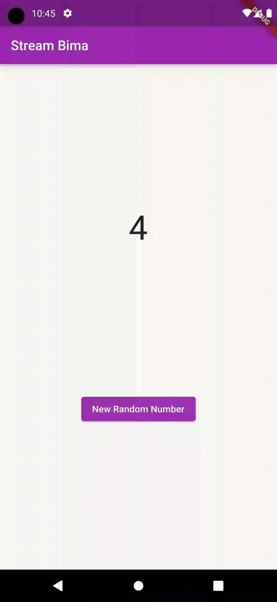

### **Soal 3**
1. Jelaskan fungsi keyword yield* pada kode tersebut!
    > **Jawaban:**
Keyword `yield` pada kode tersebut digunakan untuk menyebarkan nilai-nilai dari suatu iterable (dalam hal ini, objek `Stream.periodic`) ke dalam iterable yang sedang dibuat atau di-generate oleh fungsi yang mengandung yield*. Dengan kata lain, `yield` digunakan untuk menyatukan dua iterable.
2. Apa maksud isi perintah kode tersebut?
    > **Jawaban:**
Pada kode tersebut, `Stream.periodic` digunakan untuk membuat suatu Stream yang menghasilkan nilai setiap detik. Fungsi yang diberikan sebagai parameter kedua akan dipanggil setiap kali nilai baru dihasilkan oleh Stream.periodic. Di dalam fungsi tersebut, indeks warna dihitung berdasarkan waktu t dan diambil modulus terhadap panjang array warna (colors). Nilai yang dihasilkan oleh Stream.periodic adalah nilai-nilai indeks tersebut.
3. Lakukan commit hasil jawaban Soal 3 dengan pesan "W13: Jawaban Soal 3"

### **Soal 5**
1. Jelaskan perbedaan menggunakan listen dan await for (langkah 9) !
   > **Jawaban:**
   
   > `await for`:
   > * Digunakan dalam konteks fungsi yang dideklarasikan dengan kata kunci async.
   > * Bersifat synchronous dan memungkinkan pembatalan dengan break.
   > * Menunggu (await) setiap event atau nilai sebelum melanjutkan ke event atau nilai berikutnya.
   > * Cocok digunakan ketika Anda perlu melakukan tindakan yang bergantung pada setiap event sebelum melanjutkan eksekusi.
    
   > `listen`:
   > * Bersifat asynchronous dan tidak memerlukan fungsi yang dideklarasikan dengan kata kunci async.
   > * Tidak menunggu event atau nilai selesai sebelum melanjutkan eksekusi.
   > * Cocok digunakan ketika Anda ingin melakukan tindakan yang tidak perlu menunggu setiap event selesai sebelum melanjutkan.
3. Lakukan commit hasil jawaban Soal 5 dengan pesan "W13: Jawaban Soal 5"

### **Soal 6**

1. Jelaskan maksud kode langkah 8 dan 10 tersebut!
    > **Jawaban:**

   > Langkah 8:
   > * Menginisialisasi objek NumberStream dan StreamController.
   > * Membuat objek Stream dari StreamController.
   > * Menambahkan listener ke stream tersebut. Setiap kali ada data yang masuk ke dalam stream, fungsi yang diberikan kepada listen akan dipanggil. Dalam kasus ini, fungsi tersebut akan memperbarui lastNumber menggunakan setState. Ini umumnya dilakukan untuk memastikan bahwa perubahan nilai di dalam widget diperbarui dan direfleksikan pada antarmuka pengguna (UI).
   
   > Langkah 10:
   > * Membuat fungsi addRandomNumber yang bertujuan untuk menambahkan angka acak ke dalam stream menggunakan objek NumberStream.
   > * Fungsi ini menggunakan objek Random untuk menghasilkan angka acak antara 0 dan 9, dan kemudian memanggil metode addNumberToSink pada objek NumberStream untuk menambahkan angka tersebut ke dalam stream.

2. Capture hasil praktikum Anda berupa GIF dan lampirkan di README.
    > **Jawaban:**
    
3. Lalu lakukan commit dengan pesan "W13: Jawaban Soal 6".